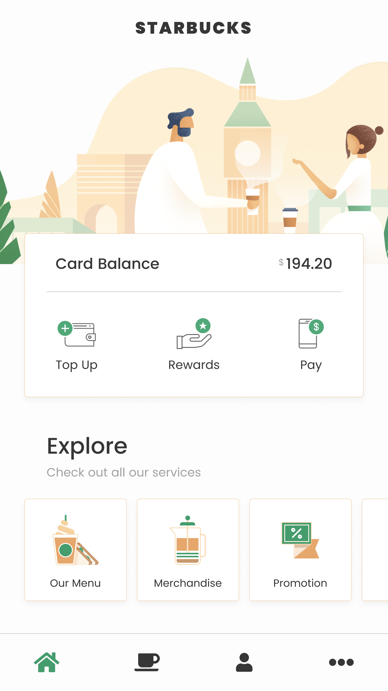

**Fala Dev!** Seja bem-vindo ao repositório do **Flutter Edition #1**. Aqui você irá encontrar o material de apoio para concluir a aplicação do workshop. Siga as instruções abaixo para iniciar sua aplicação:

- Conecte um dispositivo móvel ao computador ou tenha instalado algum emulador para simular a aplicação
- Com o Flutter já instalado em sua máquina execute o seguinte comando através do terminal: `flutter create flutter_edition`
- Entre no diretório com `cd flutter_edition`
- Execute `flutter run`

Com o diretório da aplicação já criado, chegou a hora de importar os arquivos referentes às imagens e fontes da aplicação que iremos criar:

- Clone este repositório `git clone https://github.com/engapplabs/flutter-edition.git`
- Extraia as pastas **images** e **fonts** e coloque na raíz do seu projeto recém criado

**Seu projeto deverá ficar assim:**

- flutter_edition
  - android
  - **fonts**
  - **images**
  - ios
  - lib
  - test
  - ...

**A partir daqui as instruções serão passadas pelo palestrante para importar definitivamente as imagens e fontes que serão utilizadas na aplicação**

## Print da tela que iremos criar

## Links referentes ao projeto

[Projeto no Figma](https://www.figma.com/file/cJxWamDpLh1BbAwitujQfR0z/Starbucks-Clone?node-id=0%3A1 "Flutter Edition #1")  
[Font Awesome Package](https://pub.dartlang.org/packages/font_awesome_flutter "Font Awesome")

## Flutter links

[Site Oficial do Flutter](https://flutter.dev/ "Flutter")  
[Site Oficial do Dart](https://www.dartlang.org/ "Dart")  
[Dart Packages](https://pub.dartlang.org/ "Dart Packages")  
[Linter for Dart](https://dart-lang.github.io/linter/ "Linter")

## Redes da EngApp

       